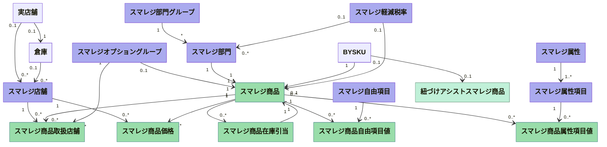
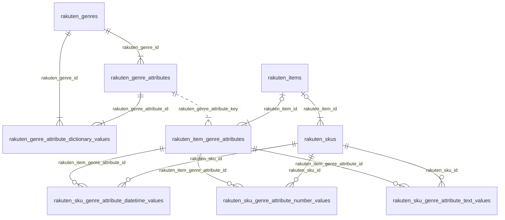

## クラス図 モデルの関連図書くならコレが一番楽

- ド頭に下記を入れると無駄な箱の下段が出ない
    ```
    ---
      config:
        class:
          hideEmptyMembersBox: true
    ---
    ```
- `classDiagram` を先頭に書く

### 説明

WIP

### 実例



## ER図

### 説明

#### 文法

`<first-entity> [<relationship> <second-entity> : <relationship-label>]`

#### 矢印の両端

Value (left)      Value (right)      Meaning

`|o`                  `o|`             Zero or one
`||`                  `||`             Exactly one
`}o`                  `o{`             Zero or more (no upper limit)
`}|`                  `|{`             One or more (no upper limit)

#### 矢印の真ん中

Value             Meaning

`--`               ID参照
`..`               ID以外の参照

#### 省略

```
erDiagram
    p[Person]
    a["Customer Account"]p ||--o| a : has
```

### 実例



## シーケンス図

- シーケンス図
    - `sequenceDiagram` を先頭に書く

### 説明

#### 登場人物

- ex `participant KEY as FULLNAME`

- 種別
    - `participant`
    - `actor`

#### 矢印

- 実線矢印
  - 名前から名前に `->>` で後ろに内容文
  - `Alice -> Bob: Authentication Request`
- 点線矢印
  - 名前から名前に `-->>` で後ろに内容文
  - `Bob --> Alice: Authentication Response`
- 自分から自分にすると ぐるっとする
